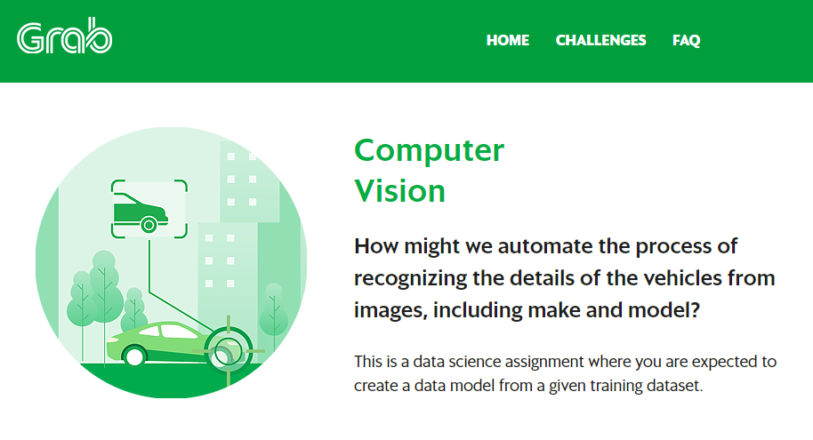
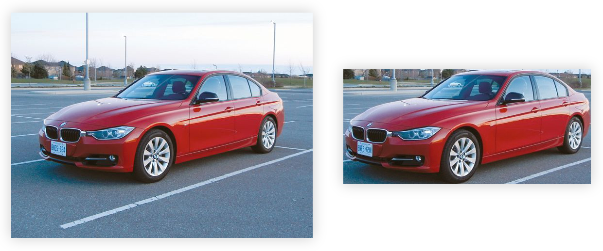
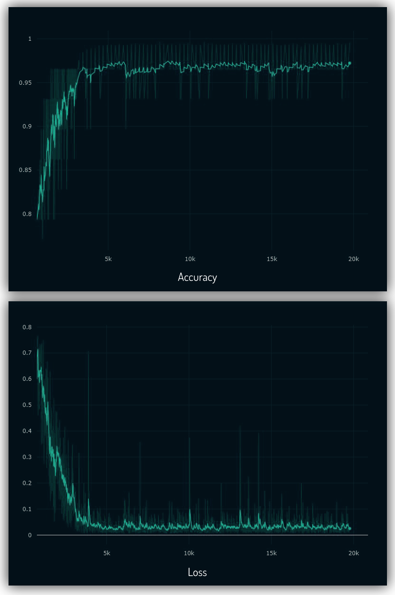
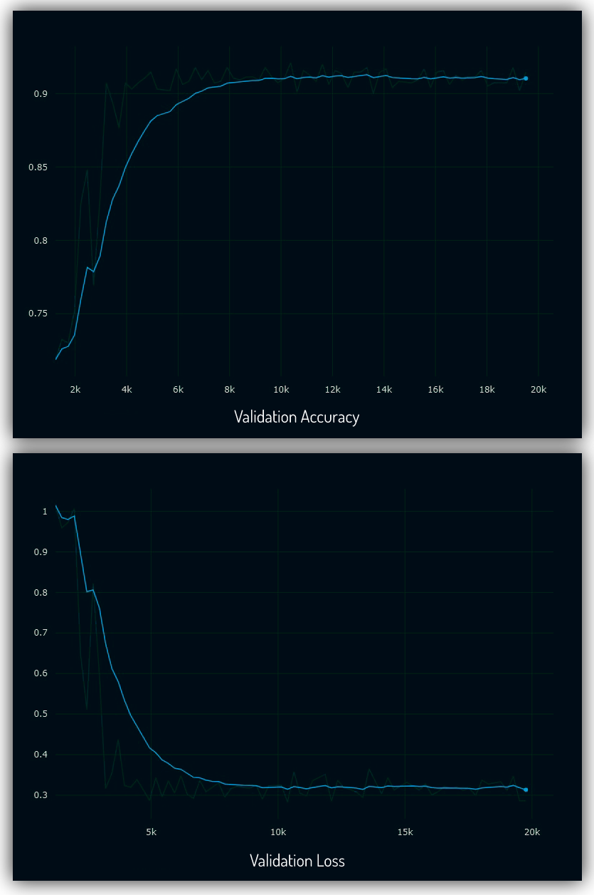
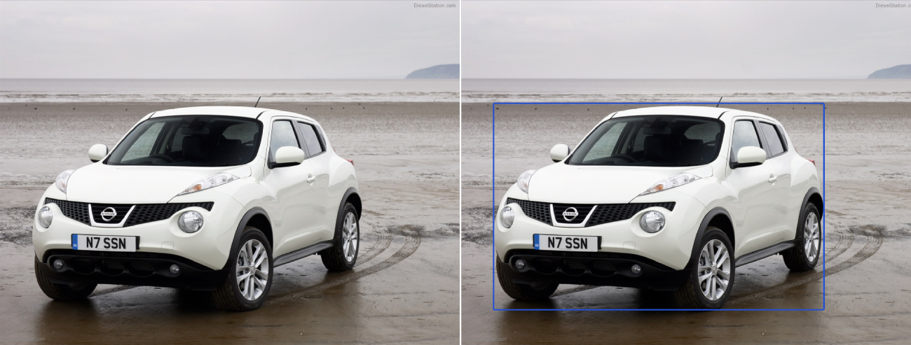

# Grab Challenge - Computer Vision

This is a submission for Grab - AIforSEA Challenge. I choose the **Computer Vision - Recognizing Car Details**



## Solution Description

This is the folder layout for the whole repository.\
Raw data from dataset are organized in the **data** folder. The processing (cropping) of the raw images are stored under **data/crop_images**.\
All meta data such as mat files and csv files are under **dataframe** folder.

1. Data Processing
2. Training
3. Testing / Evaluation

```
root
.
├── src
│   ├── mat_to_csv.py
│   ├── data_preprocessing.py
│   ├── train_utils.py
│   ├── train_densenet.py
│   └── evaluate.py
|
├── data
|   └── car_train
|       ├── 00001.jpg
|       ├── ....
|       └── 08144.jpg
|   └── car_test
|       ├── 00001.jpg
|       ├── ....
|       └── 08041.jpg
|   └── crop_images (created after running data_preprocessing.py)
│       ├── train
│       └── test
|
├── dataframe
│   ├── csv_files (created after running mat_to_csv.py)
│   └── mat_files
|
├── snapshots
│   └── model_weight_file.h5 (Placed pre-trained model weight here)
|
├── jupyter_notebook
│   ├── Example.ipynb
│   ├── Extra - Get the bounding box of car.ipynb
|   └── test_image
|
├── extra
│   ├── Extra - Get the bounding box of car.ipynb
|   └── images
|
└── README.md
```


## 1. Data Processing

### 1.1 First Step - Convert .mat to csv
First we need to convert the mat  file **car_train_annos.mat** to csv.
```bash
python3 src/mat_to_csv.py
```
The output file is **car_train.csv** in the 'dataframe/csv_files'

> ### Why I use CSV
> * I focused to use the input of training and evaluation in CSV file format.
> * CSV file is much easier to create, access, manipulate, convert to PandasDataframe and it is in general better compability format compared to Matlab file.
> * Hence, the reason I've separate the process of converting mat file to csv file from the data clean up (croppping the image).

### 1.2 Second Step - Crop Car Images
Then we need to process the raw images.\
This script will crop the car images in 'data/car_train' according to the bounding box, save it in the 'data/crop_images'.\
It read the file and bounding box from the csv file created above (**car_train.csv**).\
It will then create csv file **car_train_crop.csv** with structure "file_name, car_id" in 'dataframe/csv_files'.

```bash
python3 src/data_preprocessing.py
```


*Before and after processing*


## 2. Training

### 2.1 Train Dataset
1. I've tried the training with various backbone architecture such as Resnet, ResnetV2, InceptionResnetV2.
In the end, DenseNet169 gave the lowest validation error. Not only that, DenseNet has much lower trainable parameters (12M) compared
to the same layers in ResNet (60M).

```bash
python3 src/train_densenet.py
```

2. Using `model.fit` to fit the whole train dataset in the memory will not be viable since we got more than 8000+ images and it is not scalable to train very large data in the future.
3. Since I already have data the CSV list, I just need to convert it to Pandas Dataframe to pass it to Image Generator via `flow_from_dataframe`. This way,
the images will be generated on the fly batch by batch as the training process run.
4. Initially, using `flow_from_dataframe`, the output class were totally out of order since it sort the class by 1,10,100,101.. instead of 1,2,3,4..
I've managed to overcome this by padding the class number with zeros 001,002,003 when converting from mat file to csv (mat_to_csv.py)
5. `flow_from_dataframe` also better with this dataset than `flow_from_directory` since we don't have to rearrange the folders back according to the classes.

### 2.2 Training Result
After 80 epochs, with [image augmentation of translation and scaling](https://github.com/hazxone/grab-challenge-computer-vision/blob/9e9558b1dc014e3e9be685af559fa4c6c5831d78/src/train_densenet.py#L50-L58), I got validation loss of 0.29


*Accuracy and Loss Graph*


*Validation Accuracy and Loss Graph*


## 3. Testing / Evaluation

### 3.1 Evaluate Test Dataset
1. After training, we can use the test dataset (8041 images). First we need to convert the mat file to csv. Extract the test images from tar.gzip in the 'data/car_test', and copy **cars_test_annos_withlabels.mat** to 'dataframe/mat_files'

```bash
python3 src/mat_to_csv.py --test
```

   The output will be **cars_test.csv** in the 'dataframe/csv_files' folder

2. Then we need to crop the test images according to the bounding box

```bash
python3 src/data_preprocessing.py --test
```
The output will be **cars_test_crop.csv** in the 'dataframe/csv_files' folder and cropped images in 'data/crop_images/test'

3. Run the test evaluation

   The pre-trained weight can be download here

```bash
python3 src/evaluate.py --model snapshots/densenet.h5 --testcsv dataframe/csv_files/car_test_crop.csv --classcsv dataframe/csv_files/classes.csv
```

### 3.2 Test Result

I got **91.1%** Accuracy (7326 true predictions out of 8041 images)

### 3.3 Running Jupyter Notebook

Run Jupyter Notebook from root folder to make sure it can load the pre-trained weight in snapshots folder.
Or copy the weight into jupyter_notebook folder


## 4. Extra - Process Data as an Object Detection

So far we processed car images that already have its bounding box defined.\
This annotation process usually done manually by human annotators.\
To accurately predict the car make and model, we need properly cropped images since our model was trained on cropped images.

But what if in real life we need to process images from camera/dashcam that does not have bounding box of cars.\
Manually annotate cars location would be labour intensive.\
We can use object detection algorithm to get accurate estimation of the location of the car.

The new processing pipeline would then be:

> Raw image -> Object Detection (to get bounding box) -> Crop car according to its bounding box -> Load model and predict

There are many object detection algorithm out there such as Yolo, Faster-RCNN, SSD, but for this demonstration I used [Retinanet by fizyr](https://github.com/fizyr/keras-retinanet) to train the cars dataset and show proof of concept getting the bounding box of the cars automatically.



The example is shown on the Jupyter Notebook, however the full code to run Retinanet was not included in this repo since it would add extra complexitity to this repo. To actually load Retinanet model, we need to install / compile Cython code from its Github page.
