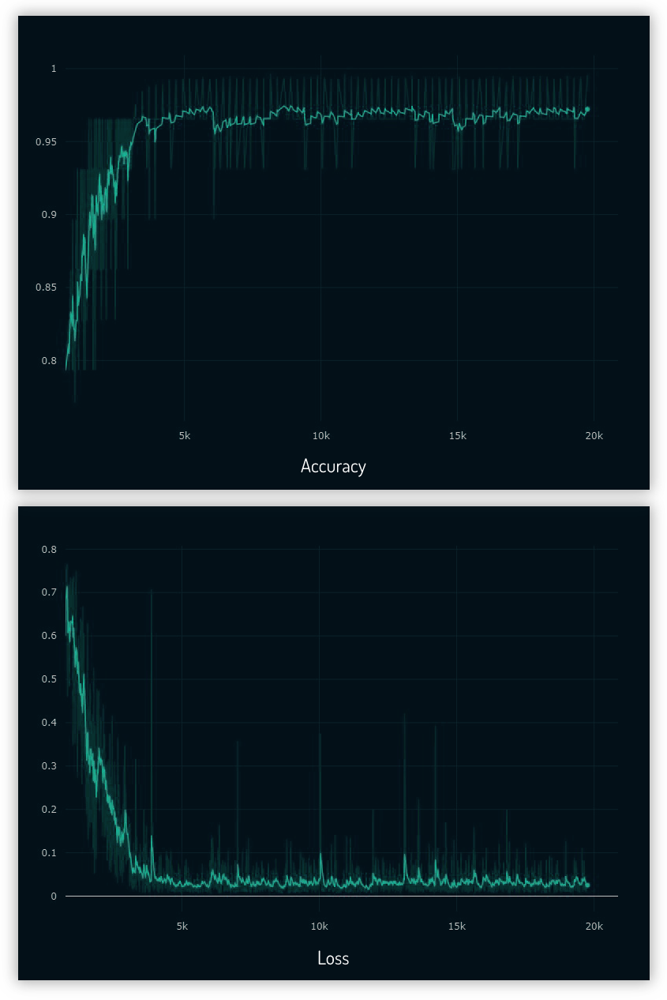

# Grab Challenge - Computer Vision

This is a submission for Grab - AIforSEA. I choose the **Computer Vision Challenge - Recognizing Car Details**\
by M Hazwan Effendi (hazwan@gmail.com)


## Solution Description

* This is the folder layout for the whole repository.
* Raw data from dataset are organized in the **data** folder. The processing (cropping) of the raw images are stored under **data/crop_images**.
* All meta data such as mat files and csv files are under **dataframe** folder.
* Weight saved from training / weight to load model during inference is inside **snapshots** folder.

1. Data Processing
3. Training
4. Testing / Evaluation
5. Extra (Using Object Detection)

```
root
.
├── src
│   ├── mat_to_csv.py
│   ├── data_preprocessing.py
│   ├── train_utils.py
│   ├── train_densenet.py
│   └── evaluate.py
|
├── data
|   └── cars_train
|       ├── 00001.jpg
|       ├── ....
|       └── 08144.jpg
|   └── cars_test
|       ├── 00001.jpg
|       ├── ....
|       └── 08041.jpg
|   └── crop_images (created after running data_preprocessing.py)
│       ├── train
│       └── test
|
├── dataframe
│   ├── csv_files (created after running mat_to_csv.py)
│   └── mat_files
|
├── snapshots
│   └── DenseNet169-epochs-47-0.26.h5 (Placed pre-trained model weight here)
|
├── jupyter_notebook
│   ├── Evaluate_Test.ipynb
|   └── test_image
|
├── extra
│   ├── Grab_object_detection.ipynb
|   └── images
|
└── README.md
```

## Installation

1. Install python modules (change tensorflow-gpu to tensorflow if NVIDIA is not available)
```
pip3 install -r requirements.txt
```

2. [Download pre-trained weights](https://drive.google.com/open?id=1repdxph5crkJKgUdQTCLhpWhDi3l3rXp) and move it to **snapshots** folder

******
## 1. Data Processing

**Exploratory Data Analysis (EDA) of the training dataset can be viewed in [this Jupyter Notebook](https://github.com/hazxone/grab-challenge-computer-vision/blob/master/jupyter_notebook/Exploratory_Data_Analysis.ipynb)**

### 1.1 First Step - Convert .mat to csv
First we need to convert the mat file *car_train_annos.mat* to csv.
```bash
python3 src/mat_to_csv.py
```
The output file is *cars_train.csv* in the **dataframe/csv_files**

### 1.2 Second Step - Crop Car Images
Then we need to process the raw images.\
This script will crop the car images in **data/cars_train** according to the bounding box and save it in the **data/crop_images**.\
It read the file and bounding box from the csv file created above (*cars_train.csv*).\
It will then create csv file *cars_train_crop.csv* with structure "file_name, car_id" in **dataframe/csv_files**.

```bash
python3 src/data_preprocessing.py
```


*Before and after processing*

## CSV Dataset

### Why I use CSV
* I focused to use the input of training and evaluation in CSV file format.
* CSV file is much easier to create, access, manipulate, convert to PandasDataframe and it is in general better compability format compared to Matlab file.
* Hence, the reason I've separate the process of converting mat file to csv file from the data clean up (croppping the image).

### CSV Mapping Format
**Class mapping**
* CSV that map the class name to car make and model name
```
car_make_and_model, car_class_id

e.g.
Buick Verano Sedan 2012,49
Buick Enclave SUV 2012,50
Cadillac CTS-V Sedan 2012,51

```

**Annotation mapping**
* CSV mapping that created from mat file
```
file_path, x1, x2, y1, y2, car_class_id

e.g.
00066.jpg,30,29,221,125,017
00067.jpg,129,89,594,432,111
```

**After crop mapping**
* CSV mapping after cropped from its bounding box and used for training, evaluation
```
file_path, car_class_id

e.g.
data/crop_images/train/00066.jpg,017
data/crop_images/train/00067.jpg,111
```


******
## 2. Training

### 2.1 Train Dataset
1. I've tried the training with various backbone architecture such as Resnet, ResnetV2, InceptionResnetV2.
In the end, DenseNet169 gave the lowest validation error. Not only that, DenseNet has much lower trainable parameters (12M) compared
to the same number of layers in ResNet (60M).

```bash
python3 src/train_densenet.py
```

2. Using `model.fit` to fit the whole train dataset in the memory will not be viable since we got more than 8000+ images and it is not scalable to train very large data in the future.
3. Since I already have data the CSV list, I just need to convert it to Pandas Dataframe to pass it to Image Generator via `flow_from_dataframe`. This way,
the images will be generated on the fly batch by batch as the training process run.
4. Initially, using `flow_from_dataframe`, the output class were totally out of order since it sort the class by 1,10,100,101.. instead of 1,2,3,4..
I've managed to overcome this by padding the class number with zeros 001,002,003 when converting from mat file to csv (*mat_to_csv.py*)
5. `flow_from_dataframe` also better with this dataset than `flow_from_directory` since we don't have to rearrange the folders back according to the classes.

### 2.2 Training Result
After 80 epochs, with [image augmentation of translation and scaling](https://github.com/hazxone/grab-challenge-computer-vision/blob/9e9558b1dc014e3e9be685af559fa4c6c5831d78/src/train_densenet.py#L50-L58), I got validation loss of 0.26


*Accuracy and Loss Graph*


*Validation Accuracy and Loss Graph*


******
## 3. Testing / Evaluation

### 3.1 Evaluate Test Dataset
1. After training complete, we can evaluate using the test dataset (8041 images). First we need to extract the test images from tar.gzip in the **data/cars_test**, and copy *cars_test_annos_withlabels.mat* to **dataframe/mat_files**. Then we need to convert the mat file to csv.

```bash
python3 src/mat_to_csv.py --test
```

   The output will be *cars_test.csv* in the **dataframe/csv_files** folder

2. After that we need to crop the test images according to its respective bounding box

```bash
python3 src/data_preprocessing.py --test
```
The output will be list of file name and car class saved in *cars_test_crop.csv* in the **dataframe/csv_files** folder. The actual cropped images are saved in **data/crop_images/test**

3. Run the test evaluation

   The pre-trained weight can be download [here](https://drive.google.com/open?id=1repdxph5crkJKgUdQTCLhpWhDi3l3rXp)

```bash
python3 src/evaluate.py --model snapshots/DenseNet169-epochs-47-0.26.h5 --testcsv dataframe/csv_files/cars_test_crop.csv --classcsv dataframe/csv_files/class.csv
```

### 3.2 Test Result

I got **91.1%** Accuracy (7326 true predictions out of 8041 images)

### 3.3 Running Jupyter Notebook

Jupyter Notebook [*Evaluate_Test.ipynb*](https://github.com/hazxone/grab-challenge-computer-vision/blob/master/jupyter_notebook/Evaluate_Test.ipynb) has the same content as *evaluate.py* but with sample of processed images displayed in the notebook


******
## 4. Extra - Process Data as an Object Detection

1. To accurately predict the car make and model, we need to cropped the images since our model was trained on cropped images.\
   So far we processed car images that already have its bounding box defined.\
   This annotation process usually done manually by human annotators.

2. But what if in real life we need to process images from camera/dashcam that does not have bounding box of cars.\
   Manually annotate bounding box of cars would be labour intensive.\
   We can use object detection algorithm to get accurate estimation of the car bounding box.

   The new processing pipeline would then be:

   `Raw image` &rarr; `Object Detection (to get bounding box coordinate)` &rarr; `Crop car according to its bounding box` &rarr; `Load model and predict`

3. There are many object detection algorithm out there such as Yolo, Faster-RCNN, SSD, but for this demonstration I will use single shot detector [Retinanet by fizyr](https://github.com/fizyr/keras-retinanet) to train the cars dataset and show proof of concept getting the bounding box automatically from images of car the model never seen before.


*The code flow example is shown in this [Jupyter Notebook](https://github.com/hazxone/grab-challenge-computer-vision/blob/master/extra/Grab_object_detection.ipynb), however the full code to run Retinanet was not included in this repo since it would add extra complexitity to this repo. Retinanet use its own custom backbone; to load Retinanet model, we need to install / compile Cython code from its Github page.*
